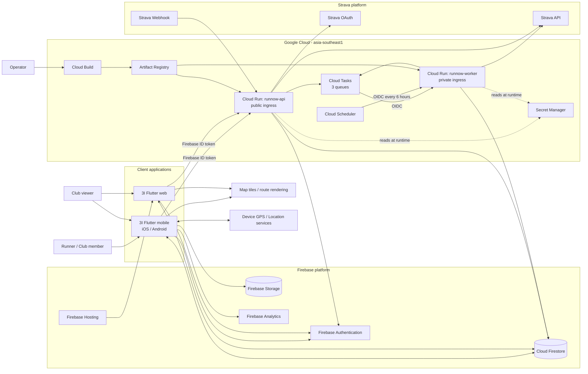
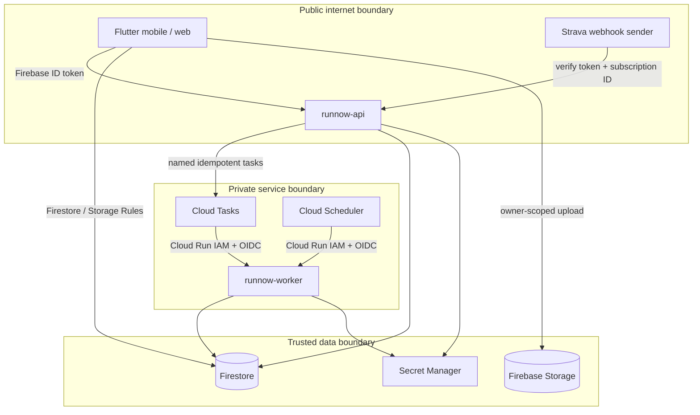
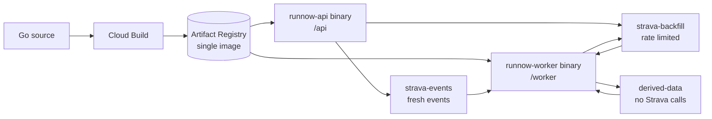
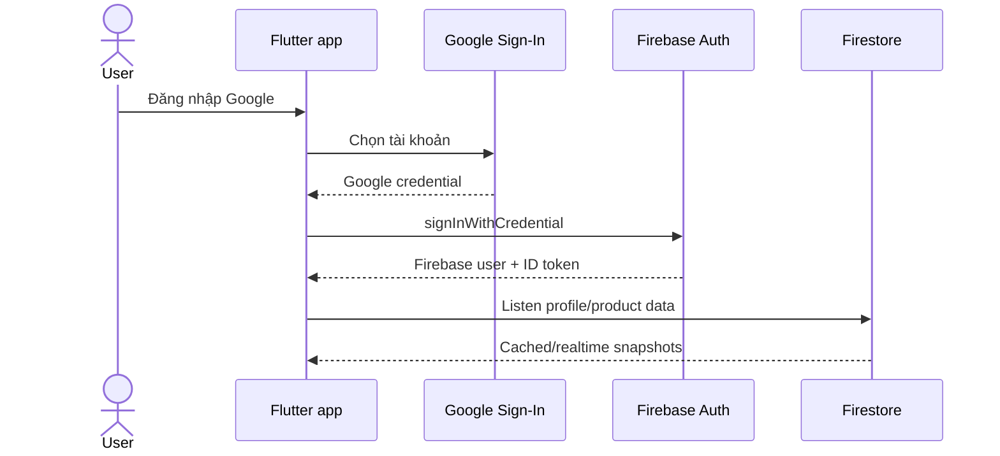
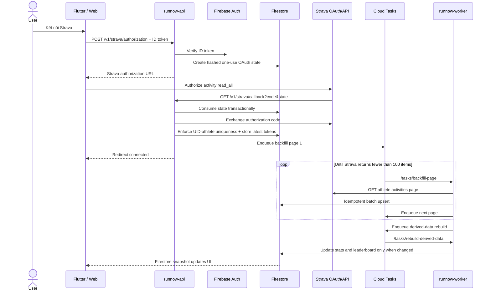
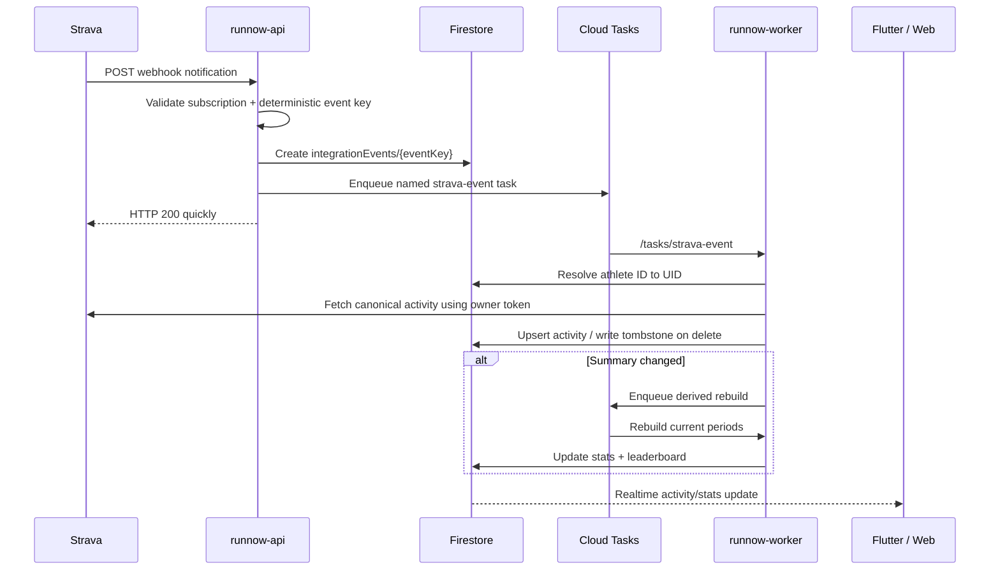
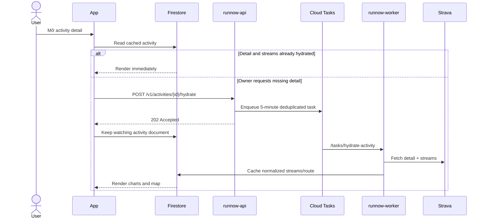
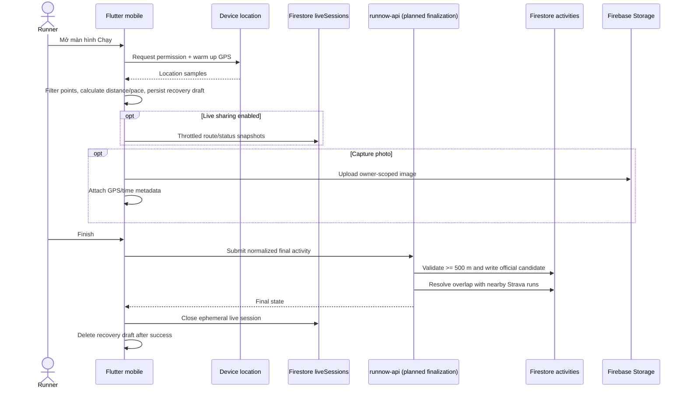
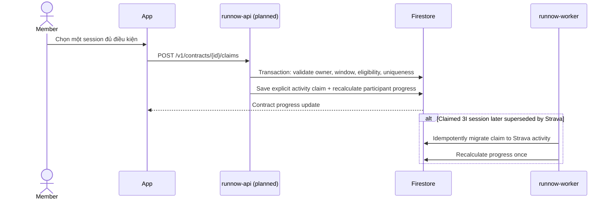
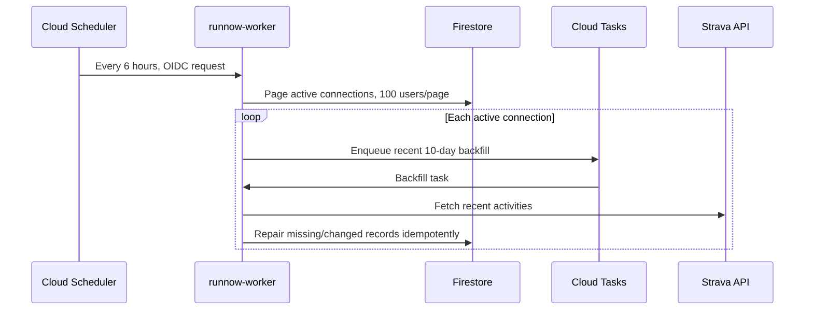

# 3I System Architecture

Tài liệu này là bản nhìn tổng thể của hệ thống 3I: ứng dụng Flutter, Firebase,
backend Go, Strava và các luồng dữ liệu chính.

## 1. System Context



## 2. Runtime And Trust Boundaries



Quyền sở hữu được chia như sau:

| Boundary | Owner | Trách nhiệm |
|---|---|---|
| Flutter | Client | UI, Firebase login, GPS sampling, local recovery, live snapshot, upload ảnh |
| `runnow-api` | Backend sync request | Firebase token verification, OAuth callback, webhook intake, enqueue work |
| `runnow-worker` | Backend async | Strava fetch, token refresh, backfill, hydrate, aggregate, reconciliation |
| Firestore Rules | Firebase | Chặn client đọc token/event và giới hạn document user được phép ghi |
| Secret Manager | Platform | Strava client secret và webhook verify token cấp ứng dụng |

## 3. Backend Deployment Topology



Hai service dùng chung image nhưng có service account, ingress, concurrency và
entrypoint riêng. API public không tự thực hiện backfill dài; worker private
không nhận request trực tiếp từ ứng dụng.

## 4. Firestore Data Architecture

```mermaid
flowchart TB
  subgraph clientReadable[Client-readable product data]
    users[(users/{uid})]
    activities[(users/{uid}/activities/{activityId})]
    stats[(users/{uid}/stats/current)]
    profiles[(publicProfiles/{uid})]
    leaderboard[(leaderboardEntries/{uid})]
    contracts[(runContracts/{contractId})]
    claims[(runContractActivityClaims/{claimId})]
    live[(liveSessions/{sessionId})]
    posts[(feedPosts/{postId})]
    goals[(trainingGoalHistory/{goalId})]
  end

  subgraph serverOnly[Backend-only integration data]
    connections[(stravaConnections/{uid})]
    athleteLinks[(stravaAthleteLinks/{athleteId})]
    oauthStates[(oauthStates/{stateHash})]
    events[(integrationEvents/{eventKey})]
    tombstones[(activityTombstones/{uid_activityId})]
  end

  subgraph binaryData[Binary data]
    storage[(Firebase Storage<br/>avatars / activity photos)]
  end

  connections -->|athlete ID| athleteLinks
  connections -->|canonical import| activities
  events -->|worker processing| activities
  tombstones -->|prevents stale resurrection| activities
  activities --> stats
  activities --> leaderboard
  activities --> claims
  claims --> contracts
  live -. ephemeral until Finish .-> activities
  activities --> storage
  users --> profiles
```

### Server-only collections

- `stravaConnections`: access token, refresh token, expiry, scopes và trạng thái.
- `stravaAthleteLinks`: bảo đảm một Strava athlete chỉ thuộc một Firebase UID.
- `oauthStates`: OAuth state dùng một lần, TTL 10 phút.
- `integrationEvents`: idempotency và trạng thái xử lý webhook, TTL 30 ngày.
- `activityTombstones`: chặn event cũ làm sống lại activity đã xóa, TTL 30 ngày.

### Product collections

- `users/{uid}/activities`: nguồn thống nhất cho Strava và session 3I.
- `users/{uid}/stats/current`: aggregate dashboard hiện tại.
- `leaderboardEntries`: snapshot phục vụ bảng xếp hạng, không quét toàn bộ activity.
- `runContracts` và `runContractActivityClaims`: Kèo và lựa chọn session rõ ràng.
- `liveSessions`: vị trí live được throttle; không phải thành tích chính thức.

## 5. Authentication Flow



Firebase UID là identity chính. Strava athlete ID chỉ là integration identity
được khóa 1-1 với UID, không thay thế Firebase Authentication.

## 6. Connect Strava And Initial Backfill



## 7. New Strava Activity Flow



Webhook chỉ là tín hiệu. Dữ liệu activity luôn được worker lấy lại từ Strava
trước khi trở thành dữ liệu chuẩn.

## 8. Detail Hydration Flow



Public viewer chỉ đọc detail đã cache; viewer không dùng token của mình để gọi
thay cho chủ activity.

## 9. Tracking And Live Tracking



Đoạn submit/finalize qua API là bước migration tiếp theo. Trong thời gian
cutover, tracking client hiện tại vẫn là implementation đang hoạt động.

## 10. Kèo Claim Flow



Không tự động gán activity vào Kèo. Người dùng luôn chọn session áp dụng; backend
chỉ xác thực và bảo vệ tính nhất quán.

## 11. Reconciliation And Recovery



Reconciliation bù webhook bị lỡ. Nó không chạy khi người dùng mở ứng dụng.

## 12. Current Implementation Status

| Capability | Trạng thái |
|---|---|
| Go API/worker foundation | Implemented, local build/test passed |
| Firebase auth verification | Implemented |
| Backend Strava OAuth and token custody | Implemented, Flutter đã cutover |
| Webhook, backfill, delete, token refresh | Implemented và đã deploy |
| Lazy detail/streams hydration | Implemented backend endpoint |
| Current week/7-day/month aggregate | Implemented backend worker |
| Flutter direct Firestore UI/offline reads | Current production behavior |
| GPS tracking and live snapshots | Current client behavior |
| Backend tracked-activity finalization | Planned |
| Backend Kèo claim/finalization | Planned |
| Client startup sync removal | Implemented |

Flutter không còn giữ hoặc refresh Strava token. Beta users phải reconnect Strava
một lần để backend nhận token; Google logout không làm mất liên kết này.
